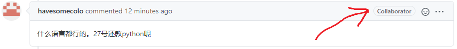

# 助教姓名与github昵称对应表

## 如何辨别用户是同学/助教和老师

助教和老师会有collaborator的标志。

另外，助教、教师的用户名对照表如下。

## 教师
| 教师姓名 | github昵称   |
|----------|--------------|
| 黄坚     | havesomecolo |
| 宋友     | songyou21    |
| 杨晴虹   |              |
| 路新喜   | laneseal     |
	
## 助教
| 助教姓名 | github昵称  |
|----------|-------------|
| 陈泓瑞   | crclz       |
| 李鑫     | SeventhGX   |
| 邢湧喆   | orixing     |
| 卓佩妍   | PineZhuo    |
| 邢智涣   | Roycent     |
| 胡鹏飞   | IAmParasite |
| 王立芃   | Lighten-w   |
| 石泽宏   | Zehong3351  |
| 张梓航   | songoku1994 |